# Le schermate, una per una

Tutte le pagine stanno sulla stessa porta e si aprono dal browser di qualsiasi
dispositivo in rete: nessuna installazione sui tablet, nessun programma sui
monitor. Quelle dei rendiconti chiedono una password, quelle degli ordini no —
il perché è spiegato nel [README](../README.md#le-statistiche-chiedono-una-password-gli-ordini-no).

Le immagini vengono da un archivio vero di sagra: i numeri sono quelli che si
vedono lavorando, non un esempio inventato.

---

## Ordini della serata

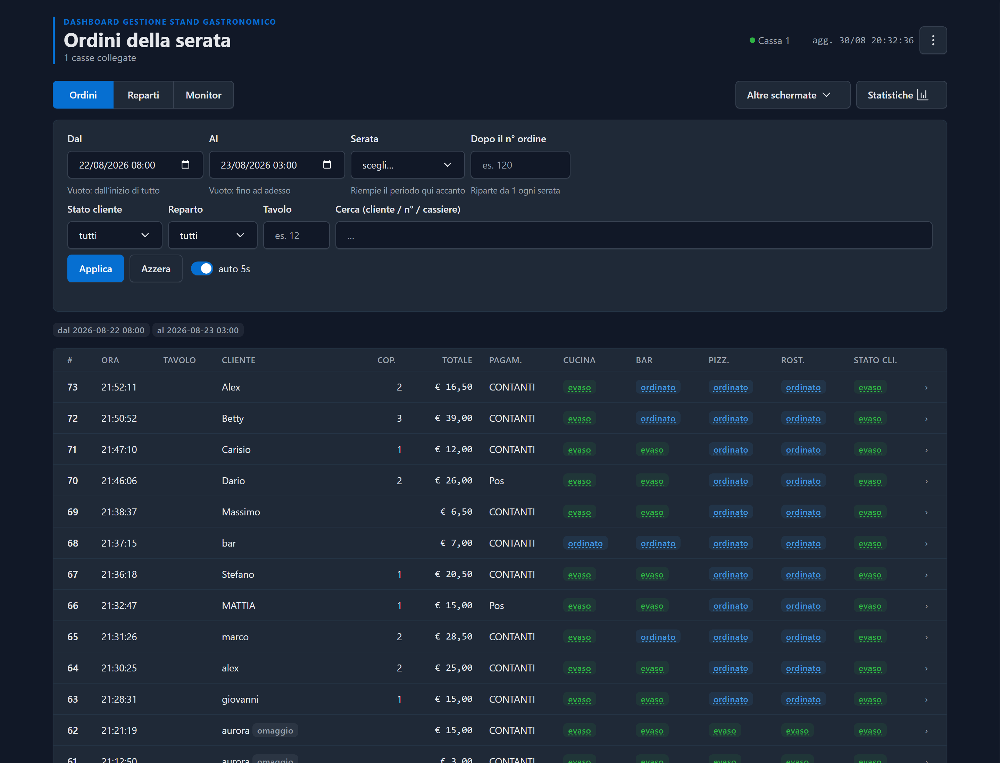

La pagina che si apre all'indirizzo del server. Ogni ordine con l'ora, il
tavolo, il cliente, i coperti, il totale, come ha pagato e a che punto è in
ogni reparto. Il periodo si sceglie dal/al, e all'apertura parte da solo
dall'inizio della serata in corso: chi guarda vede quello che sta entrando
adesso, non l'archivio.

---

## Reparti: che cosa c'è ancora da preparare

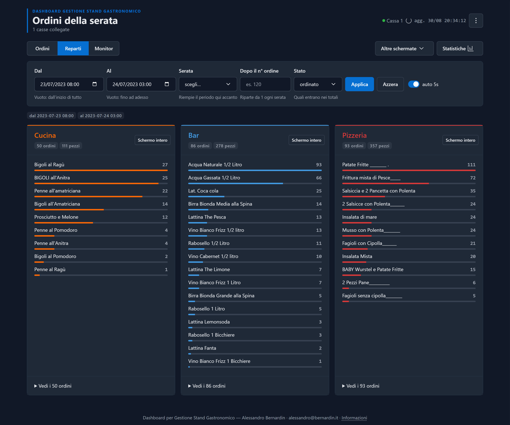

Lo stesso periodo visto per pietanza invece che per ordine, un riquadro per
reparto. Serve a chi sta in mezzo: quanti bigoli mancano, quanta acqua è
uscita, quanto è rimasto indietro un banco rispetto all'altro.

---

## Il tabellone, dentro la dashboard

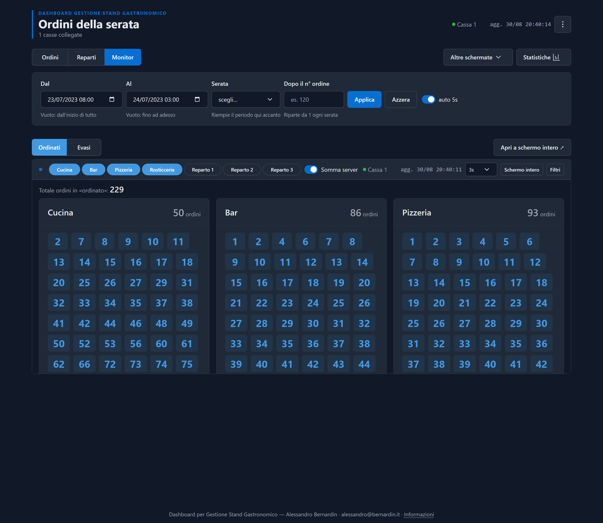

L'anteprima del tabellone degli ordini nella terza scheda, con lo stesso
periodo dei filtri: si passa da «ordinati» a «evasi» senza aprire un'altra
finestra. Il pulsante **Apri a schermo intero** è per il monitor appeso.

---

## Monitor di cucina

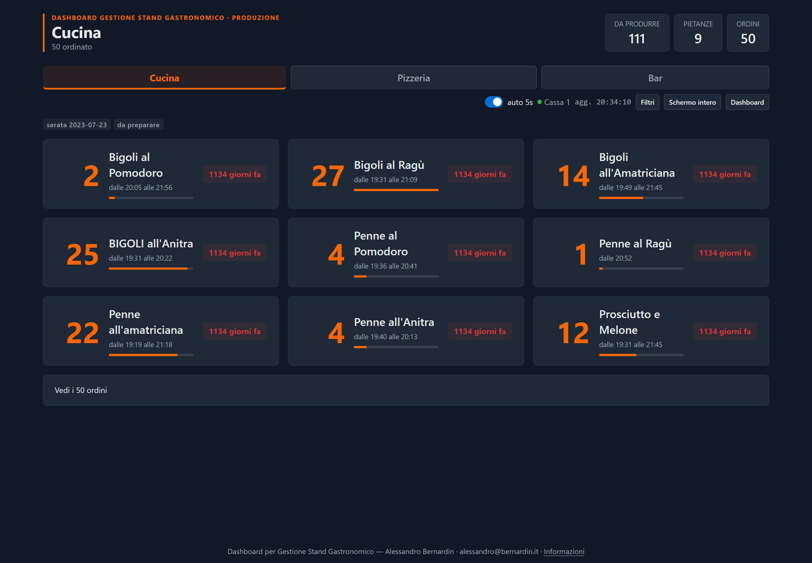

Lo schermo che sta in cucina: quante pietanze produrre, in ordine di listino,
con i minuti di attesa della più vecchia. Numeri grandi, leggibili da lontano,
aggiornamento automatico ogni pochi secondi. In alto le linguette per passare
da un reparto all'altro.

---

## Tabellone degli ordini

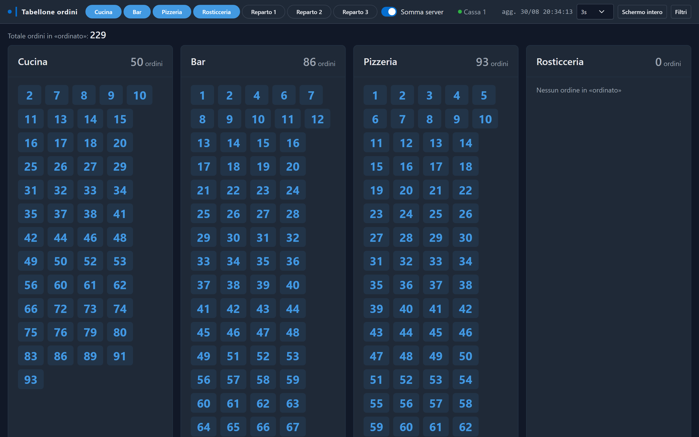

I numeri d'ordine ancora da evadere, reparto per reparto. È il tabellone che
guarda il cliente in coda, o chi consegna: quando un numero sparisce, quel
reparto ha finito.

---

## Avanzamento con il lettore di codici a barre

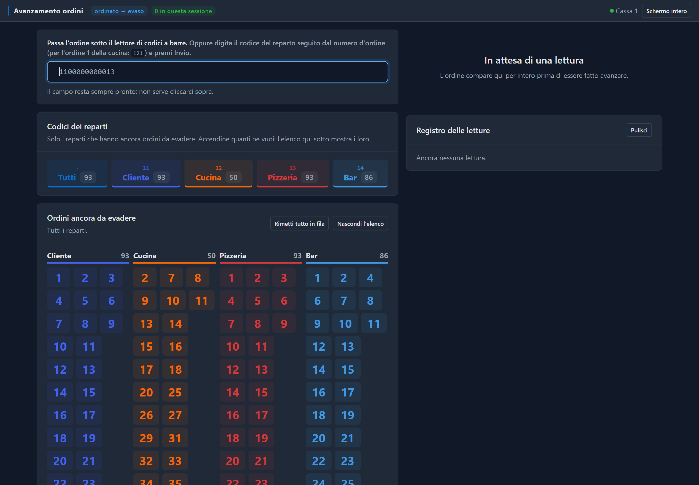

Si passa la copia stampata dell'ordine sotto il lettore e quel reparto passa da
`ordinato` a `evaso`. Il campo resta sempre pronto, senza cliccarci sopra:
sotto il tendone si lavora con le mani occupate. A destra il registro delle
letture, sotto i numeri ancora aperti.

---

## Statistiche · serate

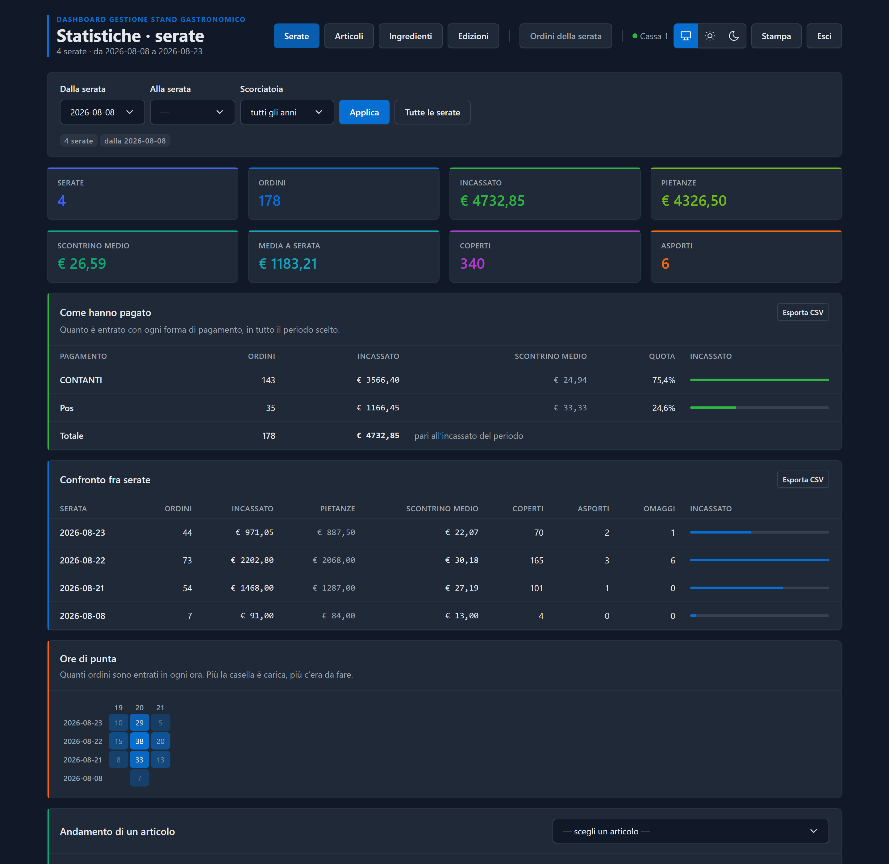

A sagra finita, dietro password: incassato, ordini, scontrino medio, coperti,
come hanno pagato, il confronto fra le serate e le ore di punta. Tutto si porta
via in CSV e si stampa.

---

## Resoconto per articolo

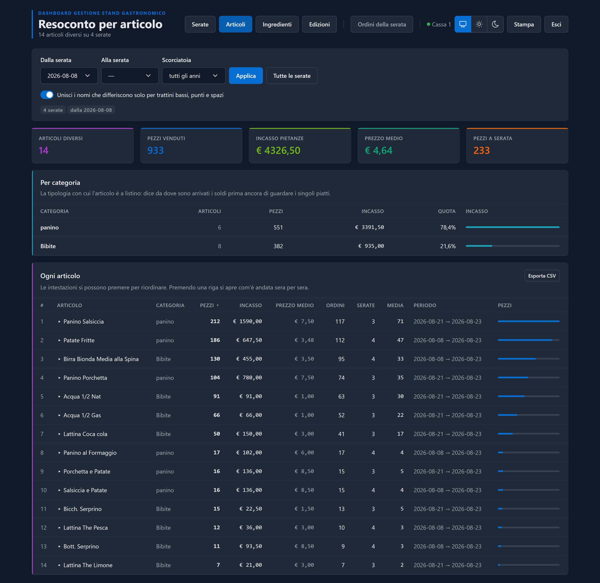

Quanto ha reso ogni piatto in tutto il periodo scelto: pezzi, incasso, prezzo
medio, in quante serate è comparso. Premendo una riga si apre com'è andato sera
per sera. È la risposta alla domanda di gennaio: quanto ne ordiniamo quest'anno.

---

## Resoconto ingredienti

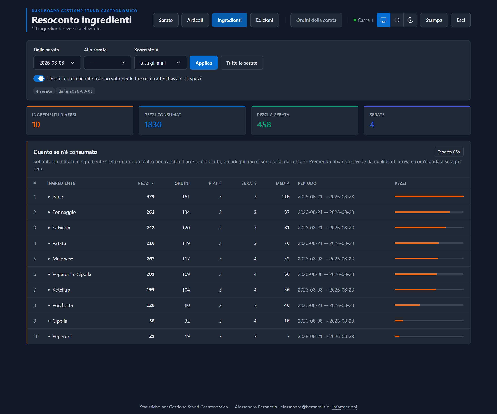

La stessa domanda, ma sulla merce: quanto pane, quanta salsiccia, quanto
formaggio se n'è andato — anche quando l'ingrediente è una scelta dentro il
piatto e non costa niente in più.

---

## Confronto fra edizioni

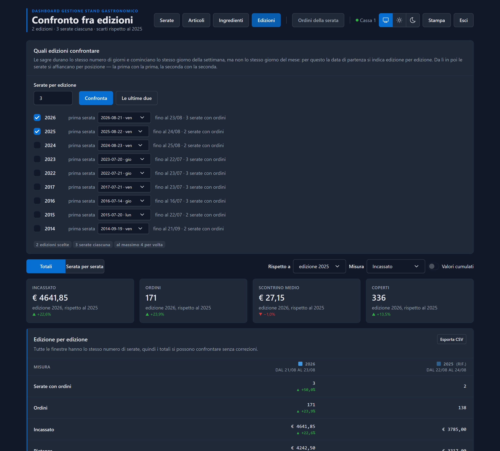

Due o più edizioni affiancate, serata per serata e in totale, con lo scarto in
percentuale rispetto a quella di riferimento. Le sagre non cominciano lo stesso
giorno del mese ma sì lo stesso giorno della settimana: si sceglie la prima
serata di ciascuna e da lì le altre si affiancano da sole.

---

## Chiaro o scuro, lo decide ogni schermo

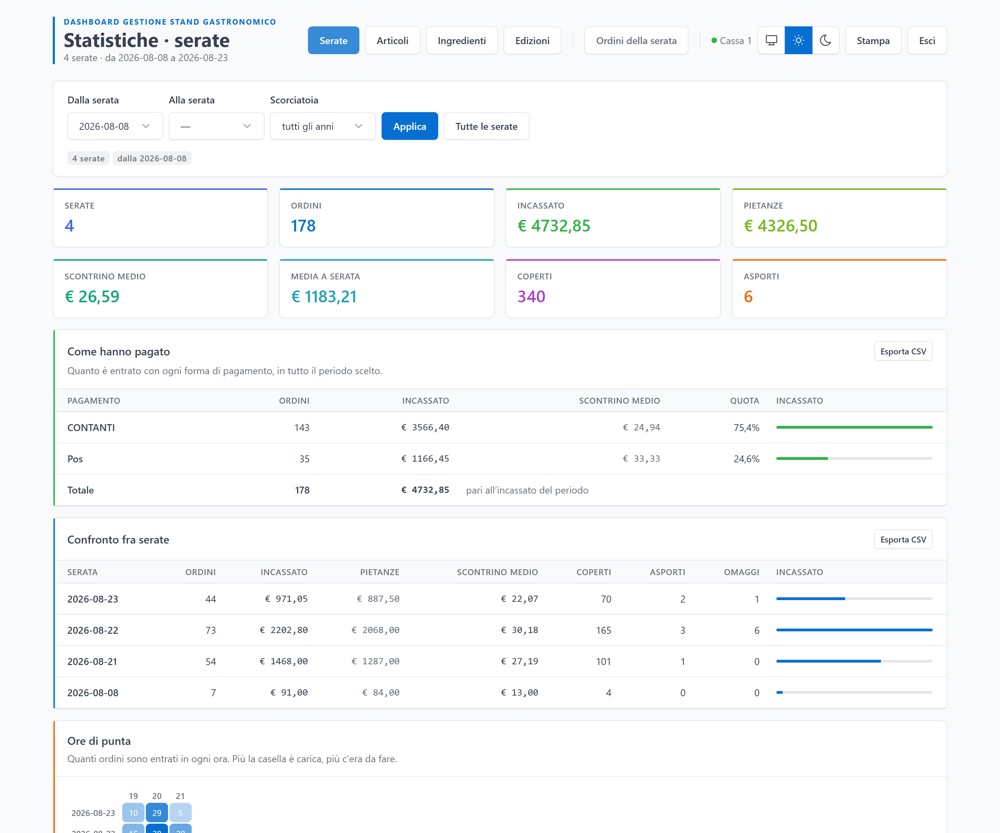

La scelta sta nel browser del singolo dispositivo, non nella configurazione
della sagra: il tablet in cassa vuole il chiaro, lo schermo appeso in cucina
vuole lo scuro anche di giorno. Il terzo stato, «come il sistema», è per chi
non vuole decidere.

---

## Su un tablet

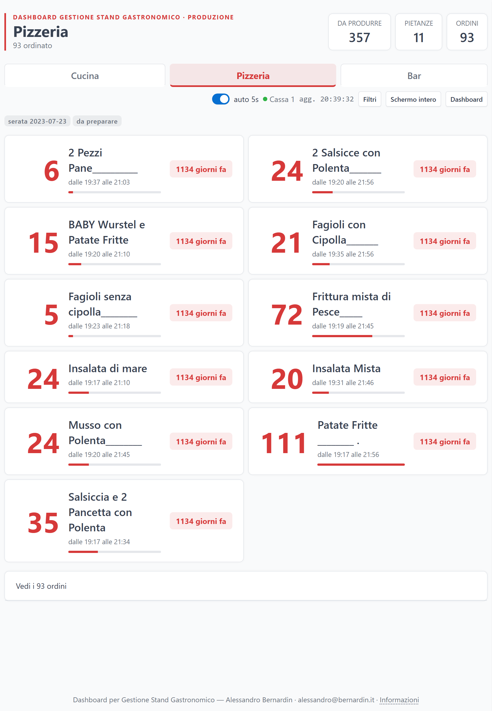

Le stesse pagine su uno schermo stretto: le colonne si riordinano da sole. Un
tablet appoggiato al banco è un monitor di reparto come gli altri, e non gli si
installa niente sopra.
